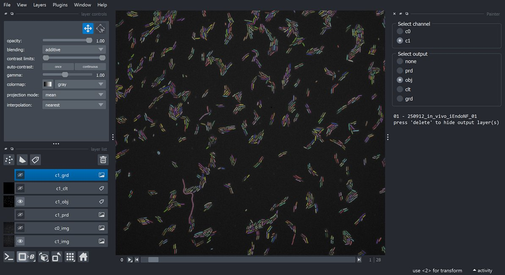

?logo=python&logoColor=rgb(149%2C157%2C165)&labelColor=rgb(50%2C60%2C65))
?logo=TensorFlow&logoColor=rgb(149%2C157%2C165)&labelColor=rgb(50%2C60%2C65))
?logo=NVIDIA&logoColor=rgb(149%2C157%2C165)&labelColor=rgb(50%2C60%2C65))
?logo=NVIDIA&logoColor=rgb(149%2C157%2C165)&labelColor=rgb(50%2C60%2C65))    
&color=rgb(149%2C157%2C165))
&color=rgb(149%2C157%2C165))
&color=rgb(149%2C157%2C165))    

# ETH-ScopeM_BactClusters  
Bacterial clusters quantification

## Index
- [Installation](#installation)
- [Usage](#usage)
- [Comments](#comments)

## Installation

Pease select your operating system

<details> <summary>Windows</summary>  

### Step 1: Download this GitHub Repository 
- Click on the green `<> Code` button and download `ZIP` 
- Unzip the downloaded file to a desired location

### Step 2: Install Miniforge (Minimal Conda installer)
- Download and install [Miniforge](https://github.com/conda-forge/miniforge) for your operating system   
- Run the downloaded `.exe` file  
    - Select "Add Miniforge3 to PATH environment variable"  

### Step 3: Setup Conda 
- Open the newly installed Miniforge Prompt  
- Move to the downloaded GitHub repository
- Run one of the following command:  
```bash
# TensorFlow with GPU support
mamba env create -f environment_tf-gpu.yml
# TensorFlow with no GPU support 
mamba env create -f environment_tf-nogpu.yml
```  
- Activate Conda environment:
```bash
conda activate bclust
```
Your prompt should now start with `(bclust)` instead of `(base)`

</details> 

<details> <summary>MacOS</summary>  

### Step 1: Download this GitHub Repository 
- Click on the green `<> Code` button and download `ZIP` 
- Unzip the downloaded file to a desired location

### Step 2: Install Miniforge (Minimal Conda installer)
- Download and install [Miniforge](https://github.com/conda-forge/miniforge) for your operating system   
- Open your terminal
- Move to the directory containing the Miniforge installer
- Run one of the following command:  
```bash
# Intel-Series
bash Miniforge3-MacOSX-x86_64.sh
# M-Series
bash Miniforge3-MacOSX-arm64.sh
```   

### Step 3: Setup Conda 
- Re-open your terminal 
- Move to the downloaded GitHub repository
- Run one of the following command: 
```bash
# TensorFlow with GPU support
mamba env create -f environment_tf-gpu.yml
# TensorFlow with no GPU support 
mamba env create -f environment_tf-nogpu.yml
```  
- Activate Conda environment:  
```bash
conda activate bclust
```
Your prompt should now start with `(bclust)` instead of `(base)`

</details>


## Usage

<p align="left">
  
</p>

### `main_[dataset].py

**Available dataset** : "cheickna", "yagmur", "chris", "suwannee" 

1) Extract images using dedicated **`extract scripts`** stored at :  
    - `.../main_[dataset]/extract_[dataset].py`

2) Call the **`Main`** class using dedicated **`main scripts`** stored at :  
    - `.../main_[dataset]/main_[dataset].py`  

The **`main scripts`** control the execution of the **`Main`** class by setting
**`procedure`** boolean flags and **`parameters`**. Each sub-section of the 
**`Main`** class depends on the outputs of the previous one and must be 
executed in order to ensure proper functionality.

#### Procedure

```yml
- prepare : bool (0 or 1)
    # load and save images from extracted image stacks stored in data_path 

- predict : bool (0 or 1)
    # generate and integrate probability images using deep learning  
    # 3 different models:
        # edt (main bacteria body)
        # interfaces (contact between bacteria)
        # skeletons (central mid-lines)

- process : bool (0 or 1)
    # generate object (obj) and cluster (clt) labelled masks + measurements 

- analyse : bool (0 or 1)
    # format results and generate plots    

- display : bool (0 or 1)
    # display outputs images in a custom Napari viewer
```

#### Parameters

```yml
Paths :

    - root_path : str 
        # path to repository root directory
    - data_path : str 
        # path to data directory (where .nd2 files are stored)

Channels :

    - prepare_channels : list of str
        # channel(s) to prepare (basically all available channel(s))
    - process_channels : list of str
        # channel(s) to process (channel(s) with bacteria to segment)
    - compare_channels : list of str
        # channel(s) to compare (bacteria channels to compare)
        # if only one bacteria channel set to None

Predict :

    - segmentation : str
        # semantic (global bacteria segmentation)
        # instance (individual bacteria segmentation)

Process :

    - parallel : bool (0 or 1)
        # run or not process procedure in parallel 

    for each processed channel

        - obj_thresh_0 : float (0 to 1) 
            # thresh. for object (bacteria) body prediction
        - obj_thresh_1 : float (0 to 1) 
            # thresh. for watershed object separation
            # should be > to obj_thresh_0
            # set to None for semantic segmentation
        - obj_min_size : int
            # min. object size (pixels)
        - clt_max_dist : int 
            # clustering distance limit (pixels)
        - grd_sigma : int
            # sigma for sato/gaussian gradient image
            # None to deactivate
        - clt_min_grd : float
            # minimum cluster avg. gradient to keep object/cluster
            # None to deactivate

Analyse :

    - conditions : list of str 
        # unique tags for identifying conditions
    - categories : list of int 
        # cluster size categories
        # expl : [3, 10]
            # cat_0 = cluster(s) with less than 3 objects
            # cat_1 = cluster(s) with 3 to 10 objects
            # cat_2 = cluster(s) with more than 10 objects
    - conds_color : list of str
        # plot colors for conditions
        # available colors : "gray", "red", "green", "blue", "yellow"
    - shade_color : list of int
        # plot color shades for conditions
        # available shades : 10, 20, 30, 40, 50, 60, 70, 80, 90 
    - chns_color : list of str
        # plot colors for channels
        # available colors : "gray", "red", "green", "blue", "yellow"

    filtering clusters (optionnal)

        - min_clt_obj_num : int
            # min. object number per cluster
                # generate extra filtered .csv files
                # affect cluster measurments in plots 
        - min_clt_area : int
            # min. cluster area (pixels)
                # generate extra filtered .csv files
                # affect cluster measurments in plots 
```

#### Outputs

```yaml
Images :

    for each image & processed channel

        from prepare : 

            - c[n]_img.tif : 2D ndarray (uint8) 
                # image 

        from predict : 

            - c[n]_prd.tif : 2D ndarray (uint8) 
                # predictions
                # integrated from the 3 different models

        from process :

            - c[n]_obj.tif : 2D ndarray (uint16) 
                # object labelled mask
            - c[n]_clt.tif  : 2D ndarray (uint16) 
                # cluster labelled mask
            
            gradient (optionnal)

                - c[n]_grd.tif : 2D ndarray (uint8) 
                    # gradient intensity

CSV/PKL files :

    # CSV files are directly "human readable".
    # PKL files are used for code execution.
    
    from process :

        for each image & processed channel

            - c[n]_obj_results.csv/pkl : CSV/PKL file 
                # object measurments
            - c[n]_clt_results.csv/pkl : CSV/PKL file 
                # cluster measurments

    from analyse :

        for each processed channel

            - obj_c[n]_results_all.csv : CSV file 
                # merged object measurments
            - clt_c[n]_results_all.csv : CSV file 
                # merged cluster measurments
            - results_c[n]_stm_avg.csv : CSV file 
                # image averaged object & cluster measurments
            - results_c[n]_cnd_avg.csv : CSV file 
                # condition averaged object & cluster measurments
            - clt_c[n]_obj_num_dist.csv : CSV file 
                # cluster object number distribution
            - clt_c[n]_obj_num_cat.csv : CSV file 
                # cluster object number categories

            filtering clusters (optionnal)

                - obj_c[n]_results_all_f.csv : CSV file 
                    # filtered merged object measurments
                - clt_c[n]_results_all_f.csv : CSV file 
                    # filtered merged cluster measurments
                - results_c[n]_stm_avg_f.csv : CSV file 
                    # filtered image averaged object & cluster measurments
                - results_c[n]_cnd_avg_f.csv : CSV file 
                    # filtered condition averaged object & cluster measurments

Plots :

    from analyse :

        for each processed channel

            - plot_c[n]_clusters.png : PNG file
                # cluster measurments plot

        compare channels (optionnal)

            - plot_compare.png : PNG file
                # compare channels plot
```

#### Results

```yml
c[n]_obj_results.csv :

    - stem           : str   # image name
    - index          : int   # object label
    - clt_index      : int   # cluster label (to which the object belong)
    - ctrd_y         : float # object centroid y coordinate
    - ctrd_x         : float # object centroid x coordinate
    - area           : int   # object area (pixels)
    - intensity      : float # object mean channel image intensity
    - gradient       : float # object std. channel gradient intensity
    - c[m]_mix_ratio : float (0 to 1)
        # compared channel mixing ratio
        # 0.0 = no overlap, 1.0 = full overlap

c[n]_clt_results.csv :

    - stem           : str   # image name
    - index          : int   # cluster label
    - obj_num        : int   # number of object(s) per cluster
    - ctrd_y         : float # cluster centroid y coordinate
    - ctrd_x         : float # cluster centroid x coordinate
    - area           : int   # cluster area (pixels)
    - intensity      : float # cluster mean channel image intensity
    - gradient       : float # cluster std. channel gradient intensity
    - circularity    : float # cluster roundness
    - solidity       : float # cluster area / convex hull area ratio
    - eccentricity   : float # cluster elongation

results_c[n]_stm_avg.csv :

    # Individual image statistics

    - stem                 : str   # image name
    - obj_num              : int   # number of objects
    - clt_num              : int   # number of clusters
    - clt_ratio            : float # ratio of clustered objects (>2 objects) 
    - obj_area_avg         : float # avg. object area (pixels)
    - obj_intensity_avg    : float # avg. object mean channel image intensity
    - obj_gradient_avg     : float # avg. object std. channel gradient intensity
    - clt_area_avg         : float # avg. cluster area (pixels)
    - clt_intensity_avg    : float # avg. cluster mean channel image intensity
    - clt_gradient_avg     : float # avg. cluster std. channel gradient intensity
    - clt_obj_num_avg      : float # avg. number of object(s) per cluster
    - clt_circularity_avg  : float # avg. cluster roundness
    - clt_solidity_avg     : float # avg. cluster area / convex hull area ratio
    - clt_eccentricity_avg : float # avg. cluster elongation

results_c[n]_cnd_avg.csv :

    # Condition merged individual image statistics
    # Same as `results_c[n]_stm_avg.csv` 
    # Except data are averaged over individual images of same condition
    
```

### `functions.py`
Shared functions.
### `train.py`
Annotate extracted images & train deep learning models.

## Comments

- Meeting 19/09/2025  
    - Add shape + density/porosity descriptors
    - Configurable categories for cluster object number (currently 2, 5, & 10)  
    - Horizontal bar plot (1 bar, 3 colors) to show these categories 
    - Add the phase-contrast image to the Napari display
    
- Meeting 24/11/2025
    
    - Short term goals:
    Finish chris analysis with simple segmentation, no object separation. 
    Run the same analysis on Suwannee data.
    The mixing measurment needs to be added in both cases. 
    Consider filter on cluster size to exclude isolated cells from the analysis.
    
    - Longer term goals:
    The idea will be to refactorize the code, extracting common parts to 
    facilitate curation. In some cases I would need object separation while in
    other cases I will go for simple segmentation. There is cases where only 
    one channel is available and other cases where two channels need to be 
    segmented and mixing between those channels needs to be measured. Also, 
    I need to come with a strategy regarding what is considered a cluster in
    the merged csv and plots. I can filter clusters acc. to object number and/
    or area (especially interesting when no object separation). The ultimate 
    goal would be to control the procedure from Napari GUI. 